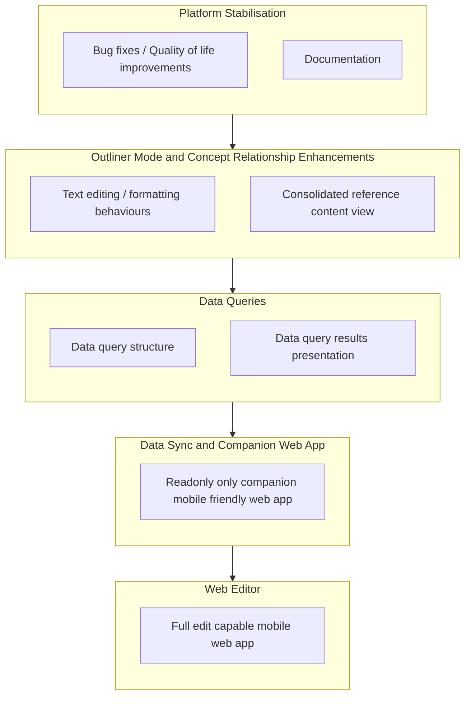

# Development Roadmap

This roadmap outlines the planned development trajectory for AS Notes. Layers are delivered sequentially - a layer begins once its predecessor is complete. Work items within a layer may be developed in parallel.

Last Update: [[2026-03-29]]

