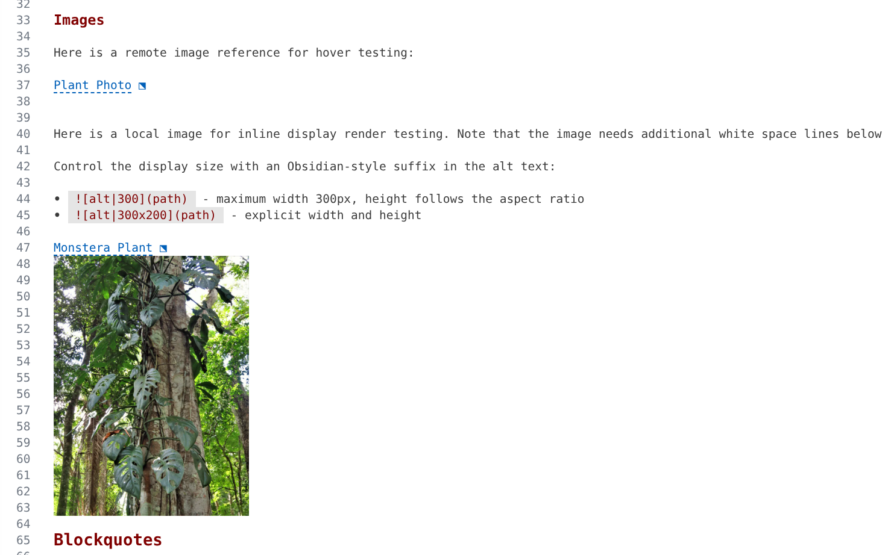
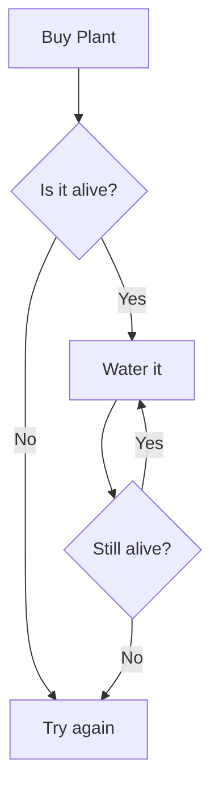
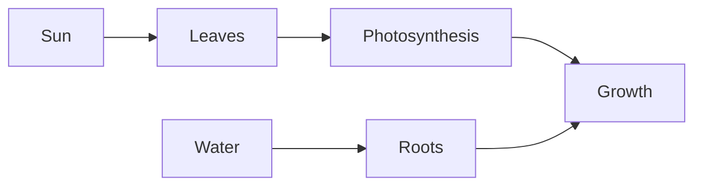

---
order: 9
---

# Inline Markdown Editing, Mermaid and LaTeX Rendering

AS Notes includes a built-in inline Markdown editor that renders formatting directly in the text editor, similar to Typora. Standard Markdown syntax characters are replaced with their visual equivalents as you write, giving you a clean reading experience without switching between edit and preview modes.

## Three-State Visibility

The inline editor uses a three-state system to manage syntax visibility:

| State | When | What you see |
|---|---|---|
| **Rendered** | Cursor is on a different line | Clean formatted text with syntax hidden |
| **Ghost** | Cursor is on the same line, outside the construct | Syntax characters at reduced opacity (30% by default) |
| **Raw** | Cursor is inside the construct | Full Markdown source |

This cycle lets you read comfortably while always having access to the raw Markdown when you need to edit.

**Example with bold text:**

- **Rendered:** The word appears **bold** with no asterisks visible
- **Ghost:** Move your cursor to the same line and faint `**` markers appear around the bold word
- **Raw:** Click directly on the bold word and the full `**bold**` syntax is shown

## Supported Constructs

The inline editor renders the following Markdown constructs:

### Text Formatting

- **Bold** (`**text**`) - rendered as bold text
- *Italic* (`*text*`) - rendered as italic text
- ***Bold italic*** (`***text***`) - rendered as both
- ~~Strikethrough~~ (`~~text~~`) - rendered with a line through it
- `Inline code` (`` `code` ``) - rendered with code styling

### Headings

Headings (`# H1` through `###### H6`) are rendered at progressively larger font sizes with bold styling. The `#` markers are hidden when rendered, visible at full opacity when the cursor is on the heading line (heading markers do not use ghost-faint like other constructs).

| Level | Font size |
|---|---|
| H1 | 180% |
| H2 | 140% |
| H3 | 120% |
| H4 | 110% |
| H5 | 105% |
| H6 | 100% |

Heading colours can be customised per level in [[Settings]].

### Links and Images

- **Links** (`[text](url)`) - syntax hidden, link text shown with link colour. Hover to preview the URL. Ctrl+Click to navigate.
- **Images** (``) - hover to see an image preview. Local images render inline in the document when standalone (see below).

#### Inline Image Rendering

A local image whose tag is alone on its line **and followed by at least one blank line** renders directly in the document - no hover needed. The rendered alt text stays visible as a link on the image's own line (hover it for the preview popup, as usual); the picture draws into the blank lines below it (the *granted space*), shrinking to fit, with the last blank line kept clear as a margin so the picture never touches the following text. Because VS Code cannot grow a single line's height, the blank lines are what give the picture room - want a bigger image? Add more blank lines below it.

Control the display size with an Obsidian-style suffix in the alt text:

- `` - maximum width 300px, height follows the aspect ratio
- `` - explicit width and height

The size hint is a *maximum* in the editor: the image never grows beyond the granted space and never overlaps text. In published HTML the hint is applied exactly, as `width`/`height` attributes with a clean `alt`.



Notes:

- Move the cursor onto the image line (or into the blank lines under the picture) to hide the picture and edit the raw syntax - the same behaviour as Mermaid blocks.
- Only local files render inline (relative or absolute paths). Remote `http(s)` images keep the hover preview.
- Mid-sentence images and images with no trailing blank line keep the hover preview.
- Supported formats: PNG, JPEG, GIF, WebP, BMP, SVG. Animated GIFs render their first frame (the hover preview still animates).

### Blockquotes and Horizontal Rules

- **Blockquotes** (`> text`) - the `>` marker is styled, text is indented
- **Horizontal rules** (`---` or `***`) - rendered as a visual separator

### Lists

- **Unordered lists** (`- item`) - the `-` marker is replaced with a styled bullet
- **Task lists** (`- [ ] item` / `- [x] item`) - rendered with a styled bullet and checkbox. Click the checkbox to toggle it.
- **Ordered lists** (`1. item`) - numbers are styled

### Code Blocks

Fenced code blocks (` ``` `) display the language label at reduced opacity when rendered. Move the cursor inside the block to see the full raw source.

### Tables

GFM pipe tables are rendered with visual grid styling. Move the cursor inside the table to see the raw pipe syntax. AS Notes' table slash commands (add/remove rows and columns) work alongside the visual rendering.

### YAML Frontmatter

Frontmatter blocks (`---` delimiters and content) are rendered at reduced opacity when the cursor is elsewhere. Move the cursor inside to see the full raw YAML.

### Emoji

Emoji shortcodes like `:smile:` or `:seedling:` are rendered as their emoji characters. The shortcode is visible in ghost/raw state.

### Mermaid Diagrams

Mermaid diagram code blocks (` ```mermaid `) are rendered as inline SVG diagrams. Hover over the code block for a preview.

The examples below are rendered from `mermaid` code blocks in the markdown document from which this document is generated.

````



````


### Math / LaTeX

Inline math (`$...$`) and display math (`$$...$$`) are rendered using KaTeX/MathJax. Enable or disable via the `as-notes.inlineEditor.math.enabled` setting.

The following code renders the math blocks below:

```
Inline math: the growth rate is $G = k \cdot L \cdot W$ where $L$ is light and $W$ is water.

Display math block:

$$
\frac{dP}{dt} = rP\left(1 - \frac{P}{K}\right)
$$
```

Inline math: the growth rate is $G = k \cdot L \cdot W$ where $L$ is light and $W$ is water.

Display math block:

$$
\frac{dP}{dt} = rP\left(1 - \frac{P}{K}\right)
$$

### GitHub Mentions and Issues

`@username` mentions and `#123` issue references are rendered with styled decorations. Enable or disable via the `as-notes.inlineEditor.mentions.enabled` setting.

## Toggle

Toggle the inline editor on or off using any of these methods:

- **Command Palette:** Run **AS Notes: Toggle Inline Editor** (`Ctrl+Shift+P`)
- **Editor title bar:** Click the eye icon
- **Setting:** Set `as-notes.inlineEditor.enabled` to `false` in VS Code settings

When toggled off, all inline decorations are removed and you see plain Markdown.

## Outliner Mode

When [[Settings|outliner mode]] is active, the inline editor works alongside it. Bullet markers and checkbox syntax are styled (bullets show as `bullet`, checkboxes show bullet + checkbox graphic) rather than being hidden. The three-state visibility still applies to inline formatting within bullet content (bold, italic, code, links, etc.).

## Conflict Detection

If you have the standalone [Markdown Inline Editor](https://github.com/SeardnaSchmid/markdown-inline-editor-vscode) extension installed, AS Notes will show a warning notification on activation. Running both will cause duplicate decorations and broken checkbox toggles. The notification offers two options:

- **Disable Extension** - disables the standalone extension
- **Disable Inline Editor** - disables the AS Notes inline editor, keeping the standalone extension active

## Settings

All inline editor settings are under the `as-notes.inlineEditor` namespace. See [[Settings]] for the full list.

Key settings:

| Setting | Default | Description |
|---|---|---|
| `as-notes.inlineEditor.enabled` | `true` | Master toggle |
| `as-notes.inlineEditor.decorations.ghostFaintOpacity` | `0.3` | Opacity for ghost-state syntax |
| `as-notes.inlineEditor.links.singleClickOpen` | `false` | Open links with single click |
| `as-notes.inlineEditor.emojis.enabled` | `true` | Render emoji shortcodes |
| `as-notes.inlineEditor.math.enabled` | `true` | Render math expressions |
| `as-notes.inlineEditor.images.enabled` | `true` | Render standalone local images inline |
| `as-notes.inlineEditor.images.maxHeightLines` | `20` | Maximum inline image height, in editor lines |
| `as-notes.inlineEditor.colors.*` | *(theme)* | Override heading, link, code colours |

## Troubleshooting

**Inline editor not active:** AS Notes must be in full mode (`.asnotes/` directory exists). Check the status bar - it should show "AS Notes" not "AS Notes (passive)".

**Decorations not appearing on a file:** The inline editor only activates for Markdown files within the AS Notes root directory. Files outside the root (e.g. a `README.md` at the workspace root when `rootDirectory` is set) are not decorated.

**Performance on large files:** The inline editor uses a parse cache and incremental updates. If you notice lag on very large files (1000+ lines), toggle the inline editor off for that session.

**Heading sizes not rendering:** This is a known VS Code platform behaviour where the `fontWeight` decoration property interferes with CSS font-size injection via `textDecoration`. AS Notes works around this by injecting `font-weight` through the CSS string. If heading sizes still don't appear, please report the issue with your VS Code version.
