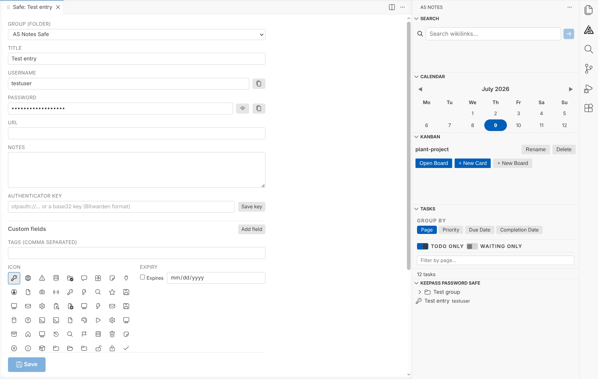

# KeePass Password Safe

AS Notes Pro can open, edit and create standard **KeePass KDBX 4** (`.kdbx`) password safes inside VS Code. The AS Notes implementation uses the standard KeePass format, so the same file opens in KeePassXC, KeePassDX, Strongbox and the other KeePass apps - AS Notes is just another editor for it, not a new silo.

Note: This is separate from [[Encrypted Notes]]. Encrypted notes are prose in `.enc.md` files; a safe is structured credentials (usernames, passwords, one-time codes, attachments) in a `.kdbx` file.

## AS Notes Pro

The password safe is a **Pro feature**, like encrypted notes. To unlock it:

1. Get a licence key from [asnotes.io](https://www.asnotes.io/pricing)
2. Run **AS Notes: Enter Licence Key** from the Command Palette (`Ctrl+Shift+P`), or paste it into the `as-notes.licenceKey` setting

See [[Licence]] for more. When Pro is active, the **KeePass Password Safe** view appears in the AS Notes sidebar.

## A note on backups first

**AS Notes writes changes straight to your `.kdbx` file.**. Before you open an existing safe for the first time, keep a backup of it somewhere safe - the first time you open a given file, AS Notes will ask you to confirm you have a backup.

Your **master password can't be recovered.** If you forget it, the safe is gone. That's how KeePass works, and it's the point - but it means the password and your backups are your responsibility.

## Creating a new safe

If you don't already have a `.kdbx`, run **AS Notes: KeePass Safe: Create New Safe** (or use the **Create New Safe** button in the sidebar). A short wizard walks you through it:

1. **Where to save** the `.kdbx` file (defaults to your home directory)
2. **A master password** - choose something strong, you'll need it every time
3. **Confirm** the master password
4. **An optional key file** - see [Key files](#key-files-second-factor) below

New safes are created with **Argon2id** key derivation and a random per-file salt, which is the current recommended setup.

## Opening an existing safe

1. Run **AS Notes: KeePass Safe: Select Safe File** (or **Open Existing Safe** in the sidebar) and point it at your `.kdbx`
2. Confirm you have a backup (first open only)
3. Enter your master password, and key file if the safe uses one

The safe stays **locked** until you unlock it. Locking wipes the decrypted contents from memory.

### Where the safe lives

The safe file usually lives **outside** your notes folder - wherever you already keep it (Dropbox, Syncthing, iCloud, a USB stick, etc.). AS Notes remembers the path.

That path is stored **per machine**, not in your notes, so it's never committed to git and can differ on each computer you use. The same is true of any key file path. If you move between machines, AS Notes simply asks you to point at the file once on each.

### Key files (second factor)

A **key file** is an optional second factor: a small file of random bytes that's combined with your master password to unlock the safe (KeePass calls this a *composite key*). Both are then needed to open the file.

- **Creating a safe:** the wizard can generate a key file for you.
- **Existing safe with a key file:** run **AS Notes: KeePass Safe: Select Key File** and point at it.

A key file is only useful as a second factor if it lives **somewhere separate from the `.kdbx`** - a USB stick, or a folder that isn't synced alongside the safe. If you keep both together, an attacker who gets the safe gets the key file too, so it adds nothing. AS Notes never stores the key file's contents, only its path.

## Browsing the sidebar

Once unlocked, the **KeePass Password Safe** view shows your groups (folders) and entries.

- A **group** is a folder. Safes are a tree: a root, containing entries and sub-groups, nested as deep as you like.
- **Search:** the filter button (`Ctrl+Shift+P` → **KeePass Safe: Search**) gives a live, type-to-filter box over entry titles, usernames and URLs.
- **Copy without opening:** each entry has inline icons to copy its **password**, **username** and (where set) its **one-time code** to the clipboard. Copied secrets are **cleared from the clipboard automatically** after a timeout (30s by default).
- **Rearrange:** drag entries and groups between groups. You can also move an entry from its editor (below).

### Adding and organising

- The **toolbar** buttons (Add Entry, Add Group) always add at the **root**.
- **Right-click a group** to add an entry or a sub-group **inside** it, or to rename / delete the group.
- Deleting moves items to the safe's **Recycle Bin** if it has one, otherwise it deletes them permanently - AS Notes tells you which before you confirm.

## Editing an entry

Open an entry to edit it in a full editor tab. The editor is a **form you save deliberately** - your changes are held until you press **Save** (bottom right), at which point they're written to the entry and the file. Nothing is written per keystroke.

If you close the tab, lock the safe, or close the workspace with unsaved changes, AS Notes prompts you to save or discard rather than losing your edits silently.

You can edit:

- **Standard fields** - title, username, password (with show / hide), URL, notes
- **Custom fields** - add, rename, remove your own named fields
- **Tags**
- **Group** - move the entry to another folder from the dropdown
- **Icon** - pick from the standard KeePass icon set
- **Expiry** - set an expiry date
- **Authenticator key** (see below)
- **Attachments** (see below)
- **History** - browse previous versions and restore one (a restore is itself reversible)

### Authenticator keys (one-time codes)

Paste an **authenticator key** into an entry and AS Notes shows the live 6-digit code beneath the field, counting down, ready to copy. It accepts the same formats as Bitwarden:

- an `otpauth://` URI (what most sites' QR codes contain), or
- a plain **base32 secret** (with or without spaces)

Either way it's stored as a standard `otpauth://` key, so KeePassXC reads it too.

### Attachments

You can add files to an entry and extract them again. Security considerations around attachments:

> **Opening** an attachment writes a temporary, **unencrypted** copy to disk so your operating system can open it in its default app. AS Notes removes that copy when the safe locks, but a crash could leave it behind.

If you'd rather never write a plaintext copy, set `as-notes.safe.allowOpenAttachments` to `false` and use **Save As…** only, which writes the file exactly where you choose and nowhere else.

## Locking

An unlocked safe **auto-locks after a period of inactivity** and clears itself from memory. You can also lock it manually. This is configurable (see settings). If auto-save on lock is on, any pending edits are saved first; if it's off, an idle lock discards unsaved edits (it can't ask you - you're not there).

## Security considerations

- **Format and crypto.** Safes use **KDBX 4** with **Argon2id** (memory-hard key derivation) and a **random per-file salt**, plus authenticated encryption. New safes are created this way; existing safes keep whatever settings they already have.
- **Backups are the users responsibility.** AS Notes edits the file in place. Keep a backup, especially before the first open. A forgotten master password is unrecoverable.
- **The master password is independent** of your [[Encrypted Notes]] passphrase - deliberately. One being compromised doesn't expose the other. I'd keep them different.
- **Key file as a second factor** only helps if it's stored apart from the safe (see above).
- **Clipboard.** Copied usernames, passwords and codes are cleared after a timeout, but be aware that clipboard managers and sync tools may still capture them in the meantime.
- **Attachments** opened in an external app leave a temporary plaintext file until the safe locks (see above) - turn the setting off if that matters to you.
- **Interoperability is a safety feature too.** Because it's real KDBX, you're never locked in: your safe opens in KeePassXC and friends, so you're not trusting AS Notes alone with your passwords.
- **Concurrent edits.** AS Notes doesn't merge. If you edit the same safe on two machines at once and both sync, you'll get a file conflict that AS Notes won't resolve for you - reconcile it in KeePassXC's database merge, or just avoid editing in two places at once. Editing on one device at a time is completely fine.

## How it works (design)

A few decisions worth knowing if you're curious about what's happening under the hood:

- **It's genuinely KeePass.** AS Notes uses the KDBX format via the `kdbxweb` library. That's why it interoperates, and it's why new safes get Argon2id and a per-file salt by construction. The trade-off we accepted is a dependency on that library and the format's rules.
- **The safe is decrypted only in the extension host**, never in the editor's web view. The editor is only ever sent the single entry you're looking at, not the whole database.
- **Editing is a buffered form.** Your changes live in a working copy and are only applied to the entry (and written to disk) when you Save. That's what makes the unsaved-changes prompts possible, and it keeps the entry's history to one version per save rather than one per keystroke.
- **Paths are per-machine.** The safe and key file locations are stored in VS Code's per-workspace, per-machine storage - never in your committed notes - so multi-machine setups with different paths just work.

## Settings

| Setting | Default | What it does |
|---|---|---|
| `as-notes.safe.autoLock` | `true` | Auto-lock the safe after inactivity, wiping it from memory |
| `as-notes.safe.autoLockTimeoutSeconds` | `300` | Idle seconds before auto-lock |
| `as-notes.safe.autoSaveOnLock` | `true` | Save pending changes when the safe locks (off = idle lock discards them) |
| `as-notes.safe.clipboardClearSeconds` | `30` | Seconds before a copied secret is cleared from the clipboard (`0` = never) |
| `as-notes.safe.allowOpenAttachments` | `true` | Allow opening attachments in their default app (writes a temporary plaintext copy). Off = Save As… only |

See [[Settings]] for the full list, and [[Getting Started]] if you're new to AS Notes.
