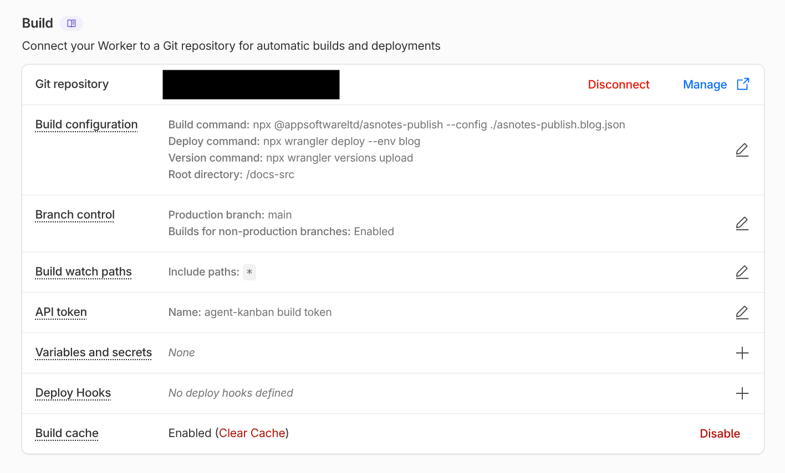

---
order: 10
---

# Publishing a Static Site

AS Notes converts your markdown notes into a static website you can deploy anywhere. Wikilinks resolve automatically, a navigation sidebar is generated, and output is clean HTML with zero dependencies.

This documentation website was built with the same tool.

## Quick Start (VS Code)

1. Open the command palette (`Ctrl+Shift+P`) and run **AS Notes: Publish to HTML**
2. The setup wizard walks you through 12 steps (template set, input directory, output directory, layout, theme, etc.)
3. Your settings are saved to a JSON config file (e.g. `asnotes-publish.json`) -- subsequent runs use them automatically

Open the output folder in a browser to preview your site.

### Quick Start (CLI)

You can pass options directly:

```bash
npx @appsoftwareltd/asnotes-publish --input ./notes --output ./docs-publish --default-public --default-assets --theme default
```

Or use a config file (created by the wizard, or written by hand):

```bash
npx @appsoftwareltd/asnotes-publish --config ./asnotes-publish.json
```

Preview locally:

```bash
npx serve ./docs-publish
```

## Choosing What to Publish

By default, only pages with `public: true` in their front matter are converted:

```yaml
---
public: true
---
```

Pass `--default-public` (or set `defaultPublic: true` in the config) to invert this -- all pages are published unless they have `public: false`.

### Encrypted Files

Files ending in `.enc.md` are always excluded. This is a hardcoded safety measure.

### Drafts

Pages with `draft: true` are excluded. Include them with `--include-drafts` for preview builds.

### Excluding Directories

`templates` and `node_modules` are excluded by default. Add more with `--exclude`:

```bash
asnotes-publish --config ./asnotes-publish.json --exclude archive --exclude scratch
```

### Dead Links

When a public page links to a non-public page via wikilink, the link renders as a dead link and a warning is logged.

## Front Matter

Control per-page behaviour with YAML front matter:

```yaml
---
public: true
title: My Page Title
order: 1
description: A short description for SEO
layout: docs
assets: true
retina: false
draft: false
date: 2025-03-23
author: Your Name
---
```

All fields are optional.

| Field | Type | Default | Description |
|---|---|---|---|
| `public` | boolean | -- | Include in output (required unless `--default-public`) |
| `title` | string | filename | Page title for `<title>` and nav |
| `order` | number | -- | Nav sort order (lower first, then alphabetical) |
| `description` | string | -- | `<meta name="description">` for SEO |
| `layout` | string | global | Per-page layout override |
| `assets` | boolean | -- | Enable asset copying for this page |
| `retina` | boolean | -- | Override global retina setting for this page |
| `draft` | boolean | false | Exclude unless `--include-drafts` |
| `date` | string | -- | Date for blog display and RSS ordering |
| `author` | string | -- | Author name (shown in blog layout) |

### Slash Commands

Type `/` in any markdown file in VS Code to quickly toggle front matter fields:

- **/Public** -- toggle `public: true/false`
- **/Layout** -- cycle through `docs`, `blog`, `minimal`
- **/Retina** -- toggle `retina: true/false`
- **/Assets** -- toggle `assets: true/false`

## Home Page

If your notes include `index.md`, it becomes the home page. If no `index.md` exists among your public pages, one is auto-generated with links to all published pages.

### Blog Index Page

When using the `blog` layout without an `index.md`, the converter auto-generates a blog index with:

- **Recent Posts** -- card-style previews of the 3 most recent posts (title, date, excerpt)
- **More Posts** -- a compact date + title list for remaining posts in the current year
- **Archive** -- grouped by year for older posts

The excerpt is the first ~160 characters of the rendered page content.

## Images and Assets

### Asset Copying

Asset copying is opt-in. Enable it per-page with `assets: true` in front matter, or globally with `--default-assets`.

The converter discovers local `` references, resolves paths relative to the source file, copies files to the output directory, and rewrites paths in the HTML. Absolute URLs and data URIs are left untouched.

### Manual Assets

Copy specific files (e.g. favicons) with `--asset`:

```bash
asnotes-publish --config ./asnotes-publish.json --asset ./favicon.ico
```

### Retina Images

Retina image sizing is **enabled by default**. The converter reads each image's intrinsic width and sets a `width` attribute at half that value, so images render crisp on high-DPI displays. A `retina` CSS class is added for `image-rendering: crisp-edges`.

To disable retina globally, set `retina: false` in your config file. To disable for a single page, add `retina: false` to its front matter.

You can also mark individual images as retina regardless of the global setting by appending `{.retina}` to the alt text:

```markdown

```

Supported formats for width detection: PNG, JPEG, GIF, WebP, BMP.

## Layouts

Three built-in layouts are available:

| Layout | Description |
|---|---|
| `docs` | Navigation sidebar + content area (default) |
| `blog` | Blog-style article with home link, post title, date, and author |
| `minimal` | Content only, no navigation |

Set the layout globally with `--layout blog` or per-page with `layout: blog` in front matter.

### Custom Layouts

The setup wizard offers to create a **layouts directory** with editable copies of all three built-in layouts. You can modify these or create new ones. Reference custom layouts by name (without `.html`).

#### Template Tokens

| Token | Replaced with |
|---|---|
| `{{title}}` | Page title (escaped) |
| `{{heading}}` | `<h1>` post title (blog layout) |
| `{{header}}` | Header partial HTML |
| `{{nav}}` | Navigation sidebar HTML |
| `{{home-link}}` | Back-to-index link (blog posts) |
| `{{content}}` | Rendered markdown body |
| `{{stylesheets}}` | `<link>` tags |
| `{{meta}}` | `<meta name="description">` tag |
| `{{date}}` | `<time>` element |
| `{{author}}` | Author display |
| `{{image}}` | Featured image |
| `{{toc}}` | Table of contents |
| `{{footer}}` | Footer partial HTML |
| `{{base-url}}` | URL path prefix |
| `{{site-title}}` | Site title text |
| `{{site-icon}}` | Site icon markup |

## Header, Footer, and Site Icon

The setup wizard creates an **includes directory** with three files:

- `header.html` -- site header (navbar, branding, links)
- `footer.html` -- site footer
- `icon.svg` -- site icon displayed in the header

### Site Icon

The converter looks for an icon file in the includes directory. It checks for `icon.svg`, `icon.png`, `icon.jpg`, `icon.jpeg`, `icon.webp`, and `icon.gif` in that order.

- **SVG** files are inlined directly into the HTML
- **Raster** files (PNG, JPG, etc.) are base64-encoded and emitted as `` tags

To use your own icon, replace `icon.svg` (or drop in an `icon.png`) in the includes directory.

### Header Tokens

Header and footer partials support these tokens: `{{base-url}}`, `{{title}}`, `{{site-title}}`, `{{site-icon}}`.

Example `header.html`:

```html
<div class="site-header">
    <a class="site-title" href="{{base-url}}/">
        {{site-icon}}
        {{site-title}}
    </a>
    <span class="header-sep">|</span>
    <a href="https://github.com/me">GitHub</a>
</div>
```

Example `footer.html`:

```html
<div class="site-footer">
    <p>&copy; 2026 My Name. Built with <a href="https://www.asnotes.io">AS Notes</a>.</p>
</div>
```

## Custom Navigation

By default, the converter generates a sidebar nav listing all public pages. To take full control, create a `nav.md` file at the root of your input directory:

```markdown
## Guides

- [[Getting Started]]
- [[Publishing a Static Site]]

---

## Reference

- [[Settings]]
- [[Wikilinks]]
```

The rendered HTML replaces the auto-generated navigation. Wikilinks in `nav.md` resolve normally. The file is not published as a standalone page.

## Template Sets

The setup wizard offers two template sets that define the visual foundation for your site:

| Template Set | Description |
|---|---|
| `tailwind` | Modern — Inter font, zinc palette, auto light/dark via system preference |
| `github` | Classic — GitHub-inspired system font stack and colours, separate light/dark themes |

The template set determines the default layouts, themes, header, footer, and icon that are scaffolded when you create directories. Both sets produce the same HTML structure (so switching later only means regenerating the scaffold files).

The tailwind set includes a single `default` theme with automatic light/dark mode based on the user's OS preference — no toggle or JavaScript required.

## Themes

Available themes depend on the template set:

**Tailwind:**

| Theme | Description |
|---|---|
| `default` | Auto light/dark based on system preference |

**GitHub:**

| Theme | Description |
|---|---|
| `default` | Light theme — clean typography and layout |
| `dark` | Dark theme — inverted colours with comfortable contrast |

Set with `--theme default`. Themes are injected as the first stylesheet, so you can layer additional stylesheets on top with `--stylesheet`.

### Custom Stylesheets

```bash
asnotes-publish --config ./asnotes-publish.json \
  --stylesheet https://cdn.example.com/markdown.css \
  --stylesheet ./my-overrides.css
```

Local file paths are automatically copied to the output. Multiple `--stylesheet` flags are allowed.

## SEO

- `description:` front matter injects `<meta name="description">`
- Filenames are slugified to clean URLs (`Getting Started.md` → `getting-started.html`)
- A `sitemap.xml` is auto-generated with all public pages
- An RSS feed (`feed.xml`) is generated for pages with a `date:` field

### Base URL

When deploying to a subdirectory (e.g. `https://example.com/docs/`), set a path prefix:

```bash
asnotes-publish --config ./asnotes-publish.json --base-url /docs
```

## Table of Contents

Every page gets a table of contents generated from `h2`--`h4` headings, rendered as a collapsible `<details>` element.

## Config File

Publish settings are stored in a JSON config file. The VS Code wizard creates this automatically.

### Schema

```json
{
    "inputDir": "",
    "outputDir": "./docs-publish",
    "defaultPublic": true,
    "defaultAssets": true,
    "layout": "docs",
    "layouts": "./layouts",
    "includes": "./includes",
    "theme": "default",
    "baseUrl": "",
    "retina": true,
    "includeDrafts": false,
    "siteTitle": "My Docs",
    "stylesheets": [],
    "exclude": []
}
```

| Field | Type | Default | Description |
|---|---|---|---|
| `inputDir` | string | `""` | Input directory (relative to config file) |
| `outputDir` | string | `""` | Output directory |
| `defaultPublic` | boolean | `false` | Publish all pages unless `public: false` |
| `defaultAssets` | boolean | `false` | Copy referenced assets unless `assets: false` |
| `layout` | string | `"docs"` | Layout: `docs`, `blog`, `minimal` |
| `layouts` | string | `""` | Custom layouts directory |
| `includes` | string | `""` | Custom includes directory (header, footer, icon) |
| `theme` | string | `""` | Built-in theme: `default`, `dark` |
| `baseUrl` | string | `""` | URL path prefix |
| `retina` | boolean | `true` | Retina image sizing |
| `includeDrafts` | boolean | `false` | Include draft pages |
| `siteTitle` | string | `""` | Site title (shown in header navbar) |
| `stylesheets` | string[] | `[]` | Stylesheet URLs or local paths |
| `exclude` | string[] | `[]` | Additional directories to exclude |

### Using the Config File

```bash
asnotes-publish --config ./asnotes-publish.json
```

CLI flags override config values. A minimal CI invocation is just the line above.

### Multi-Site Publishing

Publish multiple sites from one workspace by creating separate config files. The filename includes the input directory name:

| Input directory | Config filename |
|---|---|
| Notes root | `asnotes-publish.json` |
| `./docs` | `asnotes-publish.docs.json` |
| `./blog` | `asnotes-publish.blog.json` |

Build each separately:

```bash
asnotes-publish --config ./asnotes-publish.docs.json
asnotes-publish --config ./asnotes-publish.blog.json
```

The VS Code extension discovers all config files and shows a picker when multiple exist.

## VS Code Integration

### Setup Wizard

Run **AS Notes: Publish to HTML** with no existing config to launch the wizard:

1. **Template set** -- tailwind (modern, auto light/dark) or github (classic)
2. **Input directory** -- notes root or a subdirectory
3. **Output directory** -- where to write HTML
4. **Base URL** -- path prefix for deployed site
5. **Default public** -- publish all pages by default?
6. **Default assets** -- copy images and files?
7. **Layout** -- docs, blog, or minimal
8. **Theme** -- available themes depend on chosen template set
9. **Themes directory** -- create editable theme CSS, browse, or skip
10. **Layouts directory** -- create editable layouts, browse, or skip
11. **Includes directory** -- create header/footer/icon files, browse, or skip
12. **Site title** -- text shown in the header navbar

Settings are saved to the appropriate config file. Subsequent runs skip the wizard.

### Reconfigure

Run **AS Notes: Configure Publish Settings** to change settings without building.

## CLI Reference

```
asnotes-publish --input <dir> --output <dir> [options]
asnotes-publish --config <file> [options]

Options:
  --config <file>           Load settings from a JSON config file
  --stylesheet <url|file>   Add a stylesheet (repeatable)
  --asset <file>            Copy a file to output (repeatable)
  --default-public          Treat all pages as public unless public: false
  --default-assets          Copy referenced assets unless assets: false
  --layout <name>           Layout: docs, blog, minimal (default: docs)
  --layouts <path>          Custom layout templates directory
  --includes <path>         Custom includes directory (header, footer, icon)
  --theme <name>            Built-in theme: default, dark
  --themes <path>           Custom theme CSS directory
  --retina                  Enable retina image sizing (on by default)
  --no-retina               Disable retina image sizing
  --base-url <prefix>       URL path prefix for links and assets
  --include-drafts          Include pages with draft: true
  --exclude <dirname>       Exclude a directory (repeatable)
```

CLI flags override config file values. Default excluded directories: `templates`, `node_modules`.

### Config to CLI Mapping

| Config field | CLI flag |
|---|---|
| `inputDir` | `--input` |
| `outputDir` | `--output` |
| `defaultPublic` | `--default-public` |
| `defaultAssets` | `--default-assets` |
| `layout` | `--layout` |
| `layouts` | `--layouts` |
| `includes` | `--includes` |
| `theme` | `--theme` |
| `retina` | `--retina` / `--no-retina` |
| `baseUrl` | `--base-url` |
| `includeDrafts` | `--include-drafts` |
| `stylesheets` | `--stylesheet` (repeatable) |
| `exclude` | `--exclude` (repeatable) |

## Deploying

All examples below assume a publish config file in your repository. The wizard creates one for you, or you can write it by hand:

```json
{
    "inputDir": "./docs",
    "outputDir": "./docs-publish",
    "defaultPublic": true,
    "defaultAssets": true,
    "layout": "docs",
    "theme": "default"
}
```

The `outputDir` must match the publish/artifact path in your deploy config.

### GitHub Pages

1. Go to **Settings > Pages** and set the source to **GitHub Actions**
2. Add `.github/workflows/pages.yml`:

```yaml
name: Deploy to GitHub Pages

on:
  push:
    branches: [main]

jobs:
  deploy:
    runs-on: ubuntu-latest
    permissions:
      contents: read
      pages: write
      id-token: write
    environment:
      name: github-pages
      url: ${{ steps.deployment.outputs.page_url }}
    steps:
      - uses: actions/checkout@v4
      - uses: actions/setup-node@v4
        with:
          node-version: '20'
      - run: npx @appsoftwareltd/asnotes-publish --config ./asnotes-publish.json
      - uses: actions/upload-pages-artifact@v3
        with:
          path: docs-publish
      - id: deployment
        uses: actions/deploy-pages@v4
```

### Netlify

Add `netlify.toml` to your repo root:

```toml
[build]
  command = "npx asnotes-publish --config ./asnotes-publish.json"
  publish = "docs-publish"

[build.environment]
  NODE_VERSION = "20"
```

Connect your repository in Netlify. No `--base-url` needed.

### Vercel

Add `vercel.json` to your repo root:

```json
{
    "buildCommand": "npx asnotes-publish --config ./asnotes-publish.json",
    "outputDirectory": "docs-publish",
    "framework": null
}
```

Import your repository in Vercel.

### Cloudflare Pages

1. Go to **Compute > Workers & Pages > Create application > Pages > Connect to Git**
2. Set the build command to `npx @appsoftwareltd/asnotes-publish --config ./asnotes-publish.json`
3. Set the root directory to match the relative path of your AS Notes managed directory (this may be the root of your repository or a subdirectory depending on your initial configuration).
4. Add a `NODE_VERSION = 20` environment variable

If your config file is in a subdirectory, set the **Root directory** to that subdirectory. All relative paths in the config resolve from the root directory.



#### Multiple Sites on Cloudflare Pages

To deploy multiple publish configs (e.g. docs and a blog) from the same AS Notes managed directory, use Wrangler environments. Each environment gets its own Cloudflare Workers deployment with a separate asset directory.

Add a `wrangler.jsonc` to your AS Notes managed directory:

```jsonc
{
  "$schema": "node_modules/wrangler/config-schema.json",
  "name": "my-project",
  "compatibility_date": "2026-05-08",
  "compatibility_flags": ["nodejs_compat"],
  "env": {
    "docs": {
      "name": "my-project-docs",
      "assets": {
        "directory": "docs-publish"
      }
    },
    "blog": {
      "name": "my-project-blog",
      "assets": {
        "directory": "blog-publish"
      }
    }
  }
}
```

Build both sites, then deploy each with its environment flag:

```bash
npx asnotes-publish --config ./asnotes-publish.docs.json
npx asnotes-publish --config ./asnotes-publish.blog.json
wrangler deploy --env docs   # → my-project-docs.workers.dev
wrangler deploy --env blog   # → my-project-blog.workers.dev
```

Each environment creates an independent deployment. You can bind custom domains to each in the Cloudflare dashboard.

## HTML Structure Reference

The `docs` layout produces this structure:

```html
<body>
  <header><!-- header.html contents --></header>
  <nav class="site-nav">
    <ul>
      <li><a href="index.html">Home</a></li>
      <li class="nav-current"><a href="my-page.html">My Page</a></li>
    </ul>
  </nav>
  <article class="markdown-body">
    <nav class="toc">
      <details open>
        <summary>Contents</summary>
        <ul><li><a href="#section">Section</a></li></ul>
      </details>
    </nav>
    <!-- rendered markdown -->
  </article>
  <footer><!-- footer.html contents --></footer>
</body>
```

Key CSS classes:

| Class | Element | Description |
|---|---|---|
| `site-header` | `<div>` | Header partial wrapper |
| `site-footer` | `<div>` | Footer partial wrapper |
| `site-nav` | `<nav>` | Navigation sidebar |
| `nav-current` | `<li>` | Active page in nav |
| `markdown-body` | `<article>` | Content area (docs layout) |
| `blog-post` | `<article>` | Content area (blog layout) |
| `blog-home-link` | `<nav>` | Back-to-index link (blog posts) |
| `post-title` | `<h1>` | Post title (blog layout) |
| `blog-recent` | `<section>` | Recent posts section on blog index |
| `blog-cards` | `<div>` | Card grid container for recent posts |
| `blog-card` | `<div>` | Individual post card (title, date, excerpt) |
| `blog-card-meta` | `<div>` | Date/metadata inside a card |
| `blog-card-excerpt` | `<p>` | Excerpt text inside a card |
| `blog-year-posts` | `<section>` | Year group section on blog index |
| `blog-post-list` | `<ul>` | Compact date + title post list |
| `blog-archives` | `<section>` | Archive section on blog index |
| `toc` | `<nav>` | Table of contents |
| `page-date` | `<time>` | Date display |
| `retina` | `` | Retina image |
| `site-icon` | `` | Raster site icon (SVG icons are inlined) |
