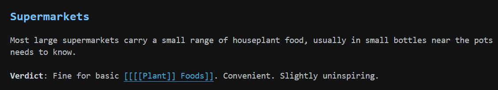
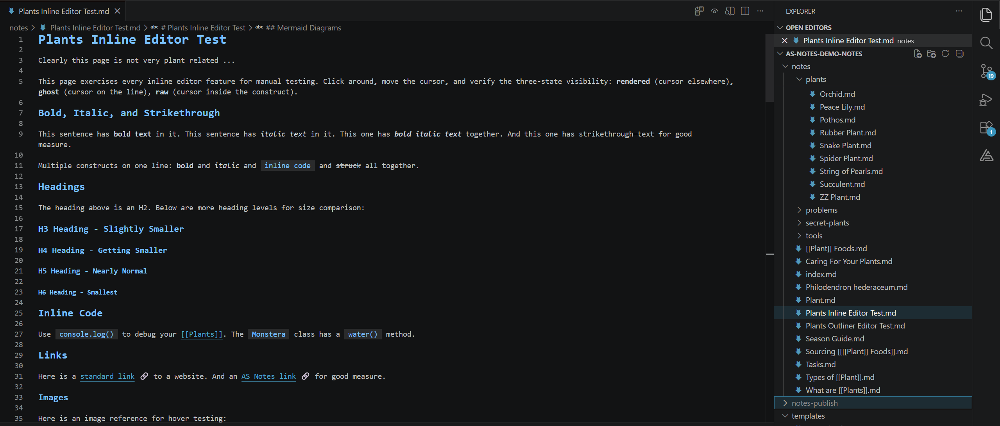
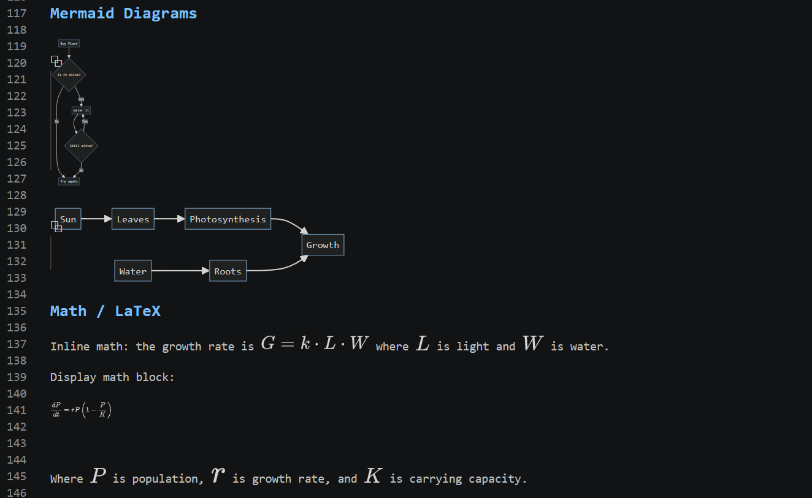
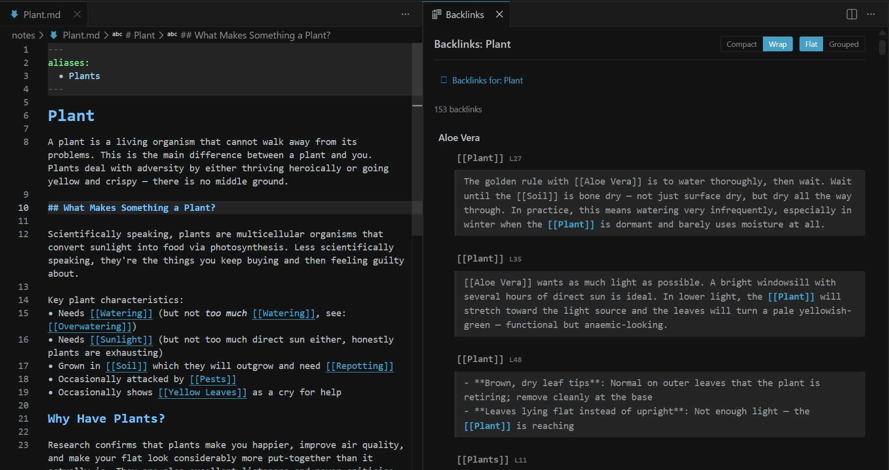
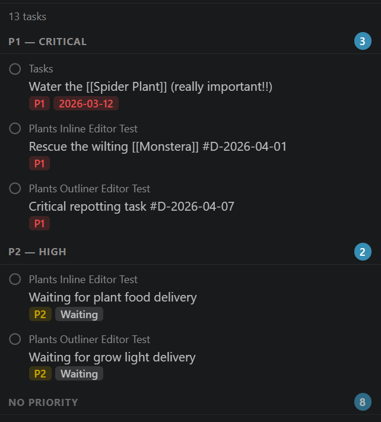
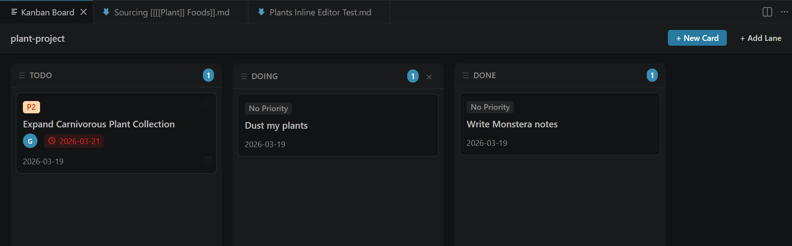
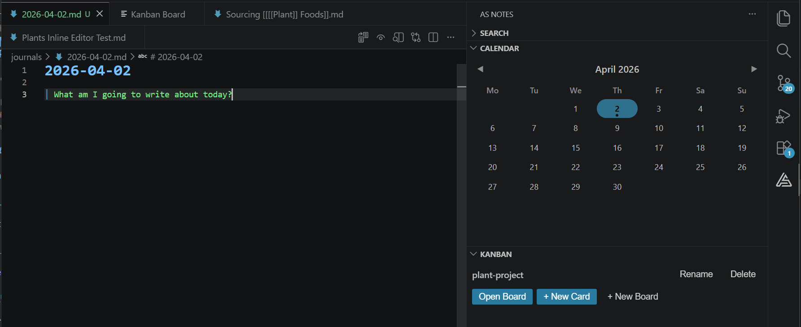
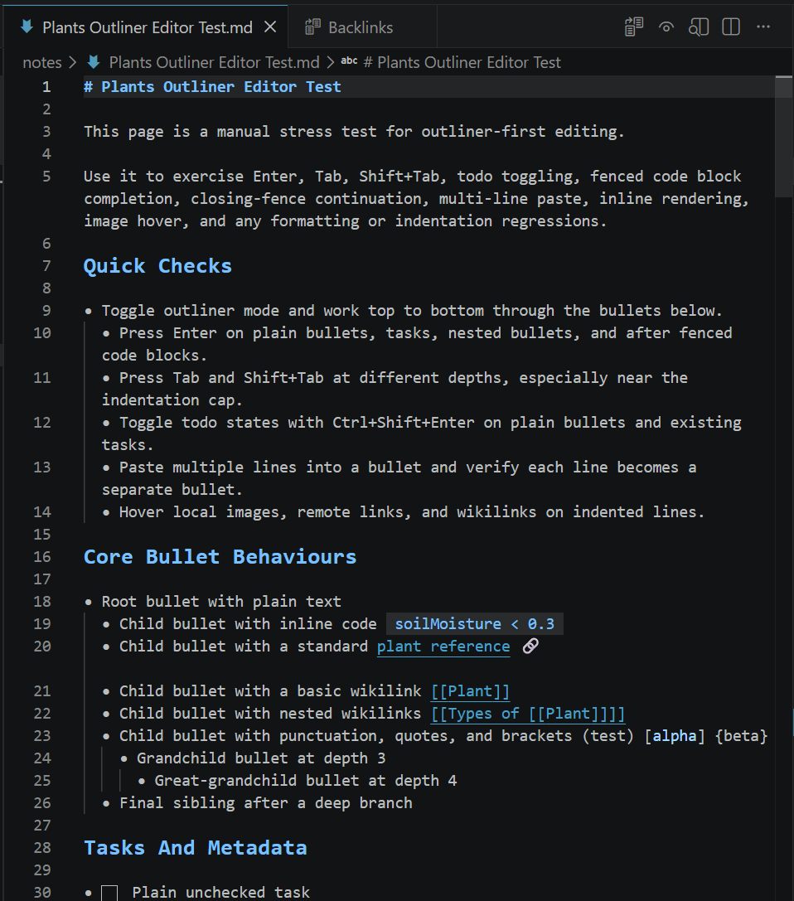
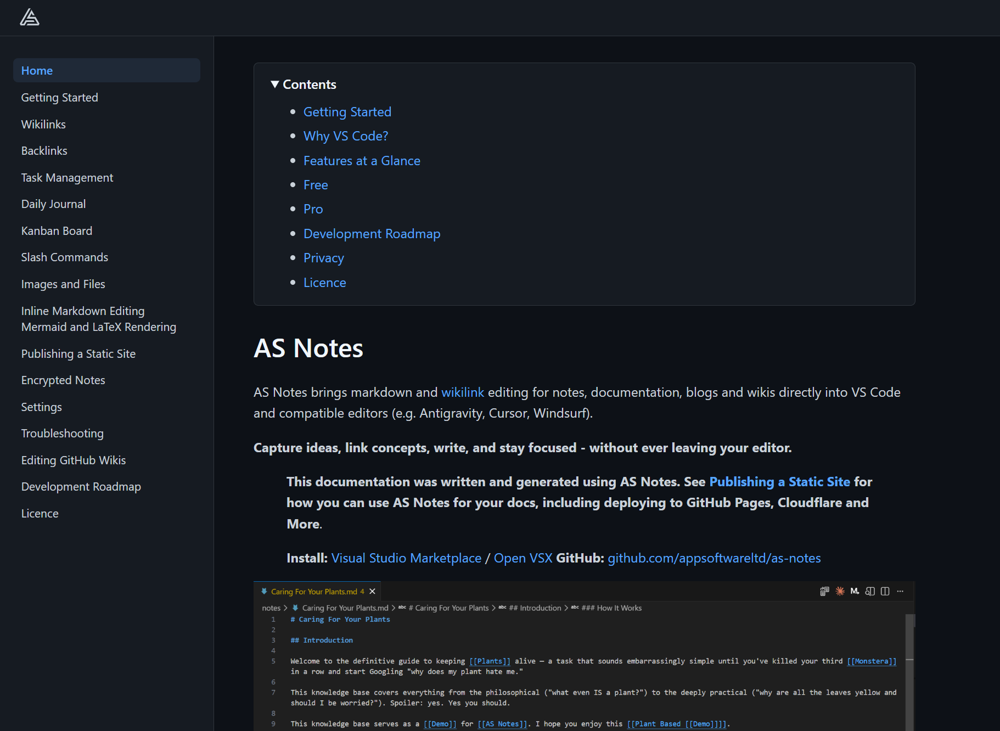

# Why AS Notes?

## What is AS Notes

**AS Notes brings markdown editing with `[[wikilink]]` for notes, documentation, blogs and wikis directly into [VS Code](https://code.visualstudio.com/) and compatible editors (e.g. [Antigravity](https://antigravity.google/), [Cursor](https://cursor.com/), [Windsurf](https://windsurf.com/)).**

**With AS Notes, you can capture ideas, link concepts, write, and stay focused - without ever leaving your editor.**

AS Notes provides productivity tooling that turns your favourite IDE into a personal knowledge management system (PKMS), including a backlinks view, task management, journals, a kanban board, markdown editing tools, mermaid, LaTeX math support and Jekyll / Hugo like publishing.

**Install:** [Visual Studio Marketplace](https://marketplace.visualstudio.com/items?itemName=appsoftwareltd.as-notes) / [Open VSX](https://open-vsx.org/extension/appsoftwareltd/as-notes)
**GitHub:** [github.com/appsoftwareltd/as-notes](https://github.com/appsoftwareltd/as-notes)

| Resource  | Url   |
|--|--|
|Install | [Visual Studio Marketplace](https://marketplace.visualstudio.com/items?itemName=appsoftwareltd.as-notes) / [Open VSX](https://open-vsx.org/extension/appsoftwareltd/as-notes)|
|Pro Features | [asnotes.io/pricing](https://www.asnotes.io?attr=src_readme)|
|Docs | [docs.asnotes.io](https://docs.asnotes.io)|
|Blog | [blog.asnotes.io](https://blog.asnotes.io)|
|Roadmap / Project Board| [docs.asnotes.io/development-roadmap](https://docs.asnotes.io/development-roadmap.html) / [github.com](https://github.com/orgs/appsoftwareltd/projects/16)|

## Why Did I Build AS Notes?

There are many note taking apps in various forms, for various devices supporting various formats. Why do we need another one?

Firstly, I'm a big fan of note taking / second brain / zettelkasten apps like Logseq and Obsidian. The main draw of these apps for many is that they offer bi-directional linking tools and importantly, are based on markdown - an open text based format that comes with inherent portability and longevity that doesn't come with closed proprietary formats that you might see in apps like OneNote or those that store your information in remote databases like Notion. I want to know that my thoughts and writing will be available to me in 30 years, without me having to continuously pay monthly subscriptions. Markdown provides that. There will always be text files and markdown will always be simple to parse, meaning that notes in markdown can survive the rise and fall of any editing tool. Secondly, markdown based tools facilitate local editing, which offers options for the privacy conscious.

As a software developer however, the existing tools didn't cover everything I needed them to. Not all work environments will allow personal knowledge management tools with the potential to sync data to private clouds (for obvious reasons). And while they may support publishing in various forms, they are not designed for building and maintaining documentation for software projects.

I wanted fast, simple wikilinks, bi-directional linking and backlinking in my documents. This feature allows both the author and the user to infer relationships between key concepts in your applications, and we're more likely to write good notes and documentation when our tooling make it easy.

AS Notes goes further by also providing markdown editing tooling along with task and productivity management tools.

Full documentation and features are available at [docs.asnotes.io](https://docs.asnotes.io)

## AS Notes Works Where You Work, and With Your Existing Tools

Many of us spend a lot of our day in VS Code and VS Code derived editors like Cursor, Antigravity or Windsurf. What I really wanted was the power of a PKMS (personal knowledge management system), with wikilinking and fast information capture, but with the flexibility to also write and maintain comprehensive, well formatted technical documentation, along with options for publishing, and I needed it to work where I spend most of my day - in the IDE.

Further, I believe in version controlling everything - code, notes and documentation. I need to work with Git friendly tools and formats. VS Code is a text editor. Text is Git friendly, and VS Code has version control tooling built in.

## The Best Place to Maintain Documentation (and Notes) Is With Your Code

I firmly believe that documentation is best maintained right next to a code base. This can also be extended to general project and planning notes too, depending on how far you want to take the idea. The reason for this is that you are far more likely to keep your documentation up to date when you are able to edit and version control docs alongside code, due to proximity and easy switching between the files.

Docs next to code also lends itself to publishing documentation to static websites, providing the option of making your documentation available via GitHub / Cloudflare Pages or other providers, and having those documents published as part of your build pipeline (CI/CD).

AS Notes can be initialised at the top level working directory, or a single subfolder (For example you may not want AS Notes active in basic README.md or LICENCE.md files). AS Notes also supports Jekyll / Hugo like publishing of selected documents or entire directories, with layout and theme support.

## Features At A Glance

### Wikilinks and Nested Wikilinks

Link notes together with `[[wikilinks]]`, including support for nested links like `[[[[AS Notes]] Page]]` that resolve multiple targets. Renaming a link updates the target file and all matching references across your workspace.



### Inline Editor Styling

Optional Typora-like inline rendering that replaces markdown syntax with visual formatting as you type. Syntax characters fade to ghost opacity when the cursor is on the line, and appear in full when editing inside a construct.



#### Mermaid and LaTeX Rendering

Mermaid diagrams and LaTeX math expressions render inline in the editor, with live updates as you edit.



### Backlinks View

See every reference to the current page in a dedicated panel. Backlinks capture surrounding context, support forward references and update live as you edit. Group by page or by chain pattern for concept-based exploration.



### Task Management

Toggle markdown TODOs with a keyboard shortcut and view all tasks across your workspace in a dedicated sidebar. Group by page, priority, due date or completion date, and filter by status or page name. Add structured metadata tags (`#P1`, `#W`, `#D-YYYY-MM-DD`) to categorise and organise tasks.



### Kanban Board

A built-in kanban board backed by markdown files for tracking long-running projects. Cards are regular notes so you can use wikilinks, tasks and all other AS Notes features inside them.



### Daily Journal

Press a keyboard shortcut to create or open today's journal entry. New entries are generated from a customisable template with placeholder support. A calendar panel in the sidebar shows the current month with journal indicators.



### Outliner Mode

Turn the editor into a bullet-first outliner where every line begins with `-`. Custom keybindings for Enter, Tab, Shift+Tab and Ctrl+Shift+Enter keep you in flow with automatic bullet continuation, indentation control and todo cycling.



### Templates

Example `Demo Template.md` - when used via the `/template` slash command , the template below would result in the following markdown and cursor placement:

```
# {{title}} - Template Placeholder Demo

Created: {{date}}
Time: {{time}}
Full timestamp: {{datetime}}

## File Info

- **Filename:** {{filename}}
- **Title:** {{title}}

## Custom Date Formats

- UK format: {{DD/MM/YYYY}}
- US format: {{MM/DD/YYYY}}
- Short year: {{DD/MM/YY}}
- Time only: {{HH:mm}}
- Full custom: {{DD/MM/YYYY HH:mm:ss}}
- Year-month: {{YYYY-MM}}
- Day-month: {{DD-MM}}

## Notes

{{cursor}}
```

Result:

```
# 2026-04-02 - Template Placeholder Demo

Created: 2026-04-02
Time: 12:15:20
Full timestamp: 2026-04-02 12:15:20

## File Info

- **Filename:** 2026-04-02
- **Title:** 2026-04-02

## Custom Date Formats

- UK format: 02/04/2026
- US format: 04/02/2026
- Short year: {{DD/MM/YY}}
- Time only: 12:15
- Full custom: 02/04/2026 12:15:20
- Year-month: 2026-04
- Day-month: 02-04

## Notes

<- Cursor here

```

### Encrypted Notes

Store sensitive notes in encrypted `.enc.md` files using AES-256-GCM encryption. Your passphrase is stored securely in the OS keychain and never written to disk. Encrypt and decrypt notes with a single command.

### Static Site Publishing

Publish selected notes or entire directories as a static HTML site with layout and theme support, similar to Jekyll or Hugo. Ideal for documentation sites, blogs, and project wikis deployed via GitHub Pages, Cloudflare Pages or other providers.



## Installing AS Notes

If you'd like to use AS Notes to manage your notes or documentation, you can install via:

[Visual Studio Marketplace](https://marketplace.visualstudio.com/items?itemName=appsoftwareltd.as-notes) / [Open VSX](https://open-vsx.org/extension/appsoftwareltd/as-notes)

## Conclusion / Feedback / Questions

If you have any questions or feedback regarding AS Notes, contact us via [asnotes.io](https://www.asnotes.io) or email <support@asnotes.io>
