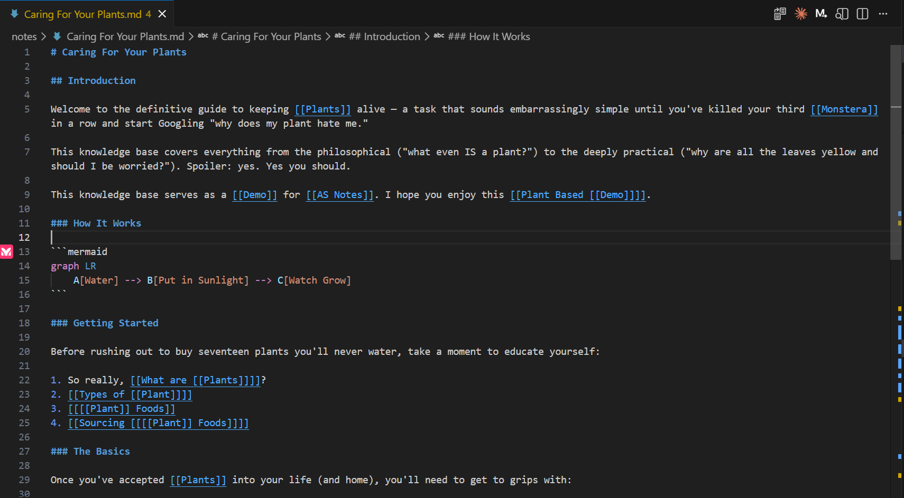

---
order: 0
---

# AS Notes

AS Notes brings markdown and [[wikilink]] editing for notes, documentation, blogs and wikis directly into VS Code and compatible editors (e.g. Antigravity, Cursor, Windsurf).

**Capture ideas, link concepts, write, and stay focused - without ever leaving your editor.**

> **This documentation was written and generated using AS Notes. See [[Publishing a Static Site]] for how you can use AS Notes for your docs, including deploying to GitHub Pages, Cloudflare and More**.

> **Install:** [Visual Studio Marketplace](https://marketplace.visualstudio.com/items?itemName=appsoftwareltd.as-notes) / [Open VSX](https://open-vsx.org/extension/appsoftwareltd/as-notes)
> **GitHub:** [github.com/appsoftwareltd/as-notes](https://github.com/appsoftwareltd/as-notes)

## Getting Started

If you've already installed AS Notes and want to get started, see [[Getting Started]].

## Why VS Code?

Using VS Code as your notes app gives you a huge amount for free in addition the features that AS Notes provides:

- Cross-platform compatibility and web access (via VS Code Workspaces)
- Tabs, file explorer, themes, keyboard shortcuts
- A vast extension library
- AI chat (GitHub Copilot, Claude, etc.) to query and work with your notes
- Syntax highlighting for code embedded in your notes

## Features at a Glance

### Free

| Feature | Summary |
|---|---|
| [[Wikilinks]] | Link between notes with `[[Page Name]]` — resolves anywhere in your workspace |
| [[Backlinks]] | See every note that links to the current page |
| [[Daily Journal]] | Open today's journal with a single shortcut |
| [[Task Management]] | Toggle todos with a keyboard shortcut and browse them all in a panel |
| [[Slash Commands]] | Insert code blocks, dates, and task tags — type `/` to open the menu |
| [[Images and Files]] | Drag and drop images, paste from clipboard, hover to preview |
| [[Publishing a Static Site]] | Convert your notes to a static website and deploy to GitHub Pages |

### Pro

| Feature | Summary |
|---|---|
| [[Slash Commands]] (Tables) | Insert and edit markdown tables directly from the slash menu |
| [[Encrypted Notes]] | Store sensitive notes in AES-256-GCM encrypted `.enc.md` files |
| [[Inline Markdown Editing Mermaid and LaTeX Rendering]] | Inline markdown editor styling and presentation including Lermaid diagrams and LaTex math |

Obtain a Pro licence key at [asnotes.io/pricing](https://www.asnotes.io/pricing).

## Development Roadmap

See our [[Development Roadmap]] to see what's coming next.

## Privacy

AS Notes is privacy-first. It never connects to external servers. All indexing, search, and backlink tracking runs entirely on your machine using an embedded SQLite database (`.asnotes/index.db`), and your notes never leave your device.

## Licence

See [[Licence]]
